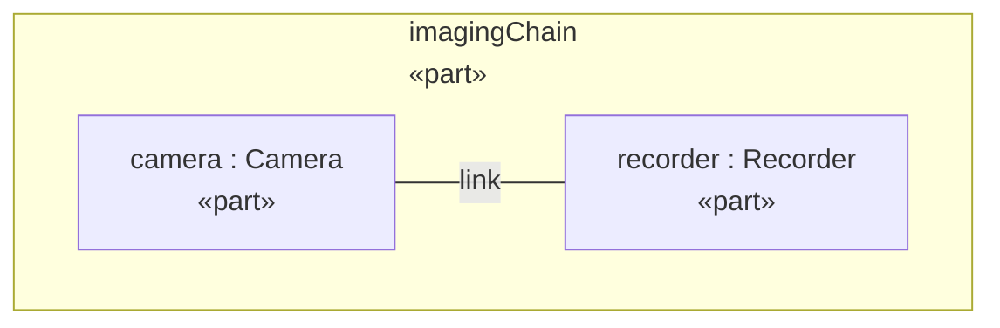
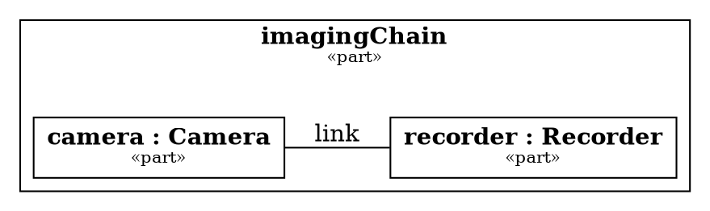

# Document Authoring

A document definition is a `part def` specializing
`DocumentQueries::Document`. Its nested parts are its content, rendered in
declaration order. This chapter covers each block; the snippets are excerpts
of models that render with the current binary (most are drawn from the
[worked example](worked-example.md)).

## Document and sections

```sysml
part def MassReport :> Document {
	attribute redefines title = "Telescope Mass Report";

	part breakdown : Section {
		attribute redefines title = "Subsystem Masses";

		part heavy : Section {
			attribute redefines title = "Heavy Subsystems";
			// ...
		}
	}
}
```

- The document's `title` is required and renders as the level-1 heading.
- A `Section` requires a `title` too and renders as a heading one level
  deeper than its parent, saturating at Markdown's level 6.
- Sections nest arbitrarily; anything a document can contain, a section can.
- A document nested inside a document is a planning error.

## Paragraphs

A `Paragraph` carries exactly one of three things:

**Static text** — a literal `text` attribute:

```sysml
part intro : Paragraph {
	attribute redefines text = "Mass rollup for the telescope assembly.";
}
```

**A query** — each projected value becomes one plain text run, joined by
spaces (nested column runs restyle this — see
[Styled query text](#styled-query-text-column-runs)):

```sysml
part summary : Paragraph {
	calc names : HeavySubsystemNames {
		in root = telescope;
		in threshold = "10";
	}
}
```

renders as `mount segmentControl`.

**Inline runs** — nested `Span`, `Link` and `Ref` parts, composed in
declaration order and joined by single spaces (next section).

Giving a paragraph both text and a query, or runs alongside either, is a
typed planning error rather than a guess about your intent.

## Inline runs, links and cross-references

```sysml
part guide : Paragraph {
	part lead : Span {
		attribute redefines text = "This report is";
	}
	part generated : Span {
		attribute redefines text = "generated";
		attribute redefines style = "emphasis";
	}
	part tool : Span {
		attribute redefines text = "sysml -render-document";
		attribute redefines style = "code";
	}
	part docsLink : Link {
		attribute redefines text = "(OpenSysML)";
		attribute redefines target = "https://opensysml.org/";
	}
	part massesRef : Ref {
		ref redefines target = breakdown;
	}
}
```

renders as:

```markdown
This report is *generated* `sysml -render-document` [(OpenSysML)](<https://opensysml.org/>) [Subsystem Masses](#breakdown)
```

**`Span`** carries required `text` and an optional `style`: `"plain"` (the
default), `"emphasis"` (`*text*`), `"strong"` (`**text**`), `"code"`
(`` `text` ``) or `"math"` (`$text$`, the text being LaTeX — see
[Mathematics](#mathematics)). Content is still escaped inside the styling — a
`*` in an emphasis span cannot break out of it, and a code span grows its
backtick fence past any backticks in the text.

**`Link`** carries required `text` and a required `target` URL, rendering as
an inline Markdown link with the destination in pointy brackets (so
parentheses and spaces in URLs survive).

**`Ref`** cross-references a named content block of this document — or of
another document — by name: `ref redefines target = <block>`. The renderer
gives the referenced block a stable HTML anchor derived from its named path —
`<a id="breakdown"></a>` before the section above — and the `Ref` renders as
a link to it. `text` is optional; it defaults to the target's title (for a
section), caption (for a table or diagram) or name. A target that is neither
a content block nor a document, or one without a stable name, is a typed
planning error.

### Cross-document references

To reference another document, declare a usage typed by the target document
definition, then name it (for the document's root) or reach into it with dot
notation (for one of its content blocks):

```sysml
ref appendix : 'Mass Appendix';

part def SystemReport :> Document {
	attribute redefines title = "System Report";
	part intro : Paragraph {
		part see : Ref {
			ref redefines target = appendix.tables.masses;
		}
		part whole : Ref {
			ref redefines target = appendix;
		}
	}
}
```

Targets resolve at planning time against the loaded workspace. A content
target renders as a relative link into the target document's generated file
with the block's stable anchor — a destination like
`Observatory-Mass.20Appendix.md#tables-masses` behind the link text;
a root target links to the file alone. The file name is deterministic: the
target document's fully qualified name with `::` replaced by `-` and any
byte outside ASCII letters, digits and `_` escaped as `.XX` (uppercase hex),
plus `.md`; where two names would meet in one file (see
[Multi-document sets](outputs.md#multi-document-sets)) the link carries the
tagged name the set writes. Render the whole set with `-render-documents
<dir>` so the links resolve on disk. Rendering a single document that
references another still succeeds — the link points at the file name the set
gives the unrendered target, and it dangles until that document is rendered
into the same directory. An unknown target is a typed planning error, and a target usage
typed by more than one document definition is an ambiguous-target error;
both carry the reference's source location.

## Styled query text (column runs)

A query-backed paragraph or list may nest **column runs** — `SpanColumn` and
`LinkColumn` parts — that map projected columns to styled runs. Each result
row renders one run per column run, in declaration order:

```sysml
part styledSummary : Paragraph {
	calc names : StyledHeavyNames {
		in root = telescope;
		in threshold = "10";
	}
	part styledName : SpanColumn {
		attribute redefines column = "name";
		attribute redefines styleColumn = "style";
	}
	part linkedName : LinkColumn {
		attribute redefines column = "name";
		attribute redefines targetColumn = "url";
	}
}
```

```markdown
**mount** [mount](<https://example.com/parts#mount>) **segmentControl** [segmentControl](<https://example.com/parts#segmentControl>)
```

**`SpanColumn`** carries a required `column` naming the projected column its
text comes from, plus at most one of:

- `style` — a fixed `"plain"` (the default), `"emphasis"`, `"strong"`,
  `"code"` or `"math"` applied to every row;
- `styleColumn` — a projected column supplying each row's style. Each row
  must supply exactly one string value among the five styles; anything else
  is a typed evaluation error naming the query, column and row.

A `"math"` column run reads each row's value as LaTeX, so a query can typeset
formulas stored on the model — a `latex` attribute of each relation, say. A
row whose math value is blank or absent is a typed evaluation error naming the
query, column and row, since an empty formula has nothing to typeset.

**`LinkColumn`** carries a required `column` for the link text and a required
`targetColumn` naming a projected column that supplies each row's one
non-empty link destination.

Computed columns (`Column(name, expression)`) feed column runs like any
projected property, so a query can compute both the text and the style or
target it renders with — the `styleColumn`/`targetColumn` example above uses
computed `style` and `url` columns. A `RelatedColumn(...)` cell is
multi-valued — a table renders its elements comma-separated, each an element
value with its `data-element` link in HTML, as any multi-valued projection is
rendered — and its `count` or `any` form is a scalar a table can group by
([Traceability matrix](query-cookbook.md#traceability-matrix)).

Column names are checked against the query's statically-known projection at
planning time; a projection only known at evaluation (e.g. a parameter-driven
`properties`) is checked when the query runs. Column runs alongside static
text or inline runs, on a paragraph without a query, or anywhere other than a
query-backed paragraph or list, are typed planning errors.

## Tables

A `Table` requires a query and may carry a `caption` (rendered in emphasis
above the table):

```sysml
part masses : Table {
	attribute redefines caption = "All subsystems by mass";
	calc rows : SubsystemTable {
		in root = telescope;
	}
}
```

```markdown
*All subsystems by mass*

| name | mass |
| --- | --- |
| mount | 15 |
| optics | 8.5 |
| segmentControl | 20 |
```

The header row is the query's projected column names; a query that projects
no columns gets a single `element` column holding each element's qualified
name. An empty result still renders the header and delimiter rows, so the
document shows *that* the table is empty rather than omitting it. Cell values
render faithfully: strings unquoted, integers in base 10, reals in shortest
notation, booleans as `true`/`false`, unbounded multiplicity as `*`, elements
— a `general`, an enumeration literal — by effective name, the one the `name`
property reads (HTML links each and carries its qualified name in
`data-element`), and quantities as the magnitude followed by the unit the
model spelt in brackets — `2290000 [kg]`, escaped in Markdown as
`2290000 \[kg\]` so the brackets read as text. An attribute whose value is
not a constant (`mass = dryMass + propellantMass`) is a typed error naming
the query, the property and the row, not an empty cell; see the [query
cookbook](query-cookbook.md#quantity-cells).

### Grouped tables

A `groupBy` attribute names one projected column; rows partition into one
subtable per distinct value of that column, in order of first appearance,
with the group key above each in strong emphasis:

```sysml
part zones : Table {
	attribute redefines caption = "Subsystems grouped by zone";
	attribute redefines groupBy = "zone";
	calc rows : ZonedSubsystems {
		in root = telescope;
	}
}
```

```markdown
*Subsystems grouped by zone*

**zone: support**

| zone | name | mass |
| --- | --- | --- |
| support | mount | 15 |

**zone: payload**

| zone | name | mass |
| --- | --- | --- |
| payload | optics | 8.5 |
| payload | segmentControl | 20 |
```

The group column must be one the query statically projects — an unknown name
is a typed error at planning time, not an empty rendering. Row order within
each group is the query's order.

### Column widths

A `columnWidths` attribute states the relative widths of the projected columns,
in order, in whatever units the source used — a migrated Cameo table keeps its
pixel widths — with `0` for a column sized automatically; an entry for every
column is not required, the rest are automatic. Renderers honour them
proportionally: HTML writes one `<col>` per column with its share of the table
width, PDF sizes the columns by them, and Markdown, which has no column widths,
ignores them ([Wide tables](outputs.md#wide-tables)).

```sysml
part masses : Table {
	attribute redefines caption = "Masses";
	attribute redefines columnWidths = (200, 0, 80);
	calc rows : MassTable {
		in root = telescope;
	}
}
```

### Column labels

A `columnLabels` attribute states the headings of the projected columns, in
order, where they differ from the column names: a column's name is the unique
key the query, `groupBy` and the HTML `data-column` attribute know it by, while
its label is what the reader sees over it, so two columns may be headed alike
(`Key` and `Key`) though named apart (`Key` and `Key 2`). `""` heads a column
by its name, and an entry for every column is not required. A migrated Cameo
table is headed as the tool headed it — `Id`, `Text`, `classifier`, the tag's
name over a stereotype-tag column — over the query properties it reads
(`shortName`, `documentation`, `general`). Every backend prints the label;
HTML keeps the name on the cell and heading as `data-column`.

```sysml
part key : Table {
	attribute redefines caption = "Key Requirements";
	attribute redefines columnLabels = ("Id", "", "Text");
	calc rows : KeyRequirements;
}
```

## Lists

A `List` requires a query and renders each result value as one item. `style`
is `"bullet"` (the default) or `"number"`; anything else is a typed planning
error. Nested column runs restyle each item's runs — see
[Styled query text](#styled-query-text-column-runs).

```sysml
part heavyItems : List {
	attribute redefines style = "number";
	calc items : HeavySubsystemNames {
		in root = telescope;
		in threshold = "10";
	}
}
```

```markdown
1. mount
2. segmentControl
```

An empty result renders as nothing — unlike a table, an empty list leaves no
trace.

## Definitions — query rows as prose

A `Definitions` block renders each query row as one prose entry: a **term**
followed by its **description**, both taken from projected columns the block
names. It is how model-authored text — a requirement's short name and its
`doc` body, a part's identifier and its description — reads as sentences
rather than as cells. `term` and `description` are required and name
projected columns of the bound query; either may be a property (`shortName`,
`name`, `documentation`, …) or a computed `Column`:

```sysml
calc def Reqs :> Query {
	in root : Element;
	Project(
		source = RelatedElements(
			source = WhereType(source = Descendants(source = root, maxDepth = 1), type = "RequirementUsage"),
			relationshipKind = "typing", direction = "outgoing", maxDepth = 1
		),
		properties = ("shortName", "name", "documentation")
	)
}

part requirementText : Definitions {
	attribute redefines term = "shortName";
	attribute redefines description = "documentation";
	calc rows : Reqs {
		in root = spec;
	}
}
```

```markdown
**HLR-R001** — The mission shall safely return all three crew members to Earth.

**HLR-R002** — The mission shall achieve a soft landing on the lunar surface.
```

Markdown writes one paragraph per row: the term in strong emphasis, an em
dash, then the description. HTML writes a description list — `<dl>` with one
`<dt>`/`<dd>` group per row, each group carrying the row's element — so a
theme can style terms and descriptions apart; PDF follows the Markdown form.
A cell with several values (an element with two `doc` comments) joins them
with spaces, as a list item does. A row whose term is absent renders its
description alone and vice versa; a row with neither writes nothing in
Markdown and an empty group in HTML. An empty result follows a list's: it
leaves no trace in Markdown, while HTML keeps the empty `<dl>` — as it keeps
an empty `<ul>` — so the block stays addressable by name and query.

Both column names are checked against the query's statically-known
projection at planning time; a name the query does not project is a typed
error there, or at evaluation when the projection is only known then. A
`Definitions` block without a query, or one nesting other content, is a typed
planning error.

The complete model is [`examples/requirements.sysml`](examples/requirements.sysml)
and its rendered output [`examples/requirements.md`](examples/requirements.md):

```console
$ sysml docs/manual/examples/requirements.sysml -run-query "Requirements::Reqs root=Requirements::spec"
$ sysml docs/manual/examples/requirements.sysml -render-document Requirements::RequirementsReport
$ sysml docs/manual/examples/requirements.sysml -render-document Requirements::RequirementsReport -doc-form html
```

## Mathematics

Formulas are written in LaTeX, inline or displayed. An inline formula is a
`Span` (or `SpanColumn`) with `style = "math"`; a displayed one is a
`Formula` block with the LaTeX in `source` and an optional `caption`:

```sysml
part intro : Paragraph {
	part lead : Span {
		attribute redefines text = "The mirror's mass scales as";
	}
	part scaling : Span {
		attribute redefines text = "m \\propto D^{2.5}_{\\text{eff}}";
		attribute redefines style = "math";
	}
	part cost : Span {
		attribute redefines text = "and each $ of budget buys about 1 cm^2 of aperture.";
	}
}
part mirrorArea : Formula {
	attribute redefines caption = "Collecting area of a circular mirror";
	attribute redefines source = "A = \\pi \\left(\\frac{D}{2}\\right)^2 = \\frac{\\pi D^2}{4}";
}
```

renders as:

```markdown
The mirror's mass scales as $m \propto D^{2.5}_{\text{eff}}$ and each \$ of budget buys about 1 cm^2 of aperture.

*Collecting area of a circular mirror*

$$
A = \pi \left(\frac{D}{2}\right)^2 = \frac{\pi D^2}{4}
$$
```

The LaTeX passes through untouched: math is the one run whose text is not
escaped as prose, so `\frac`, `_{eff}` and `^2` reach the typesetter as
written (SysML string literals still need their own backslashes doubled). In
return, ordinary prose is kept out of the math: a `$` in a plain span renders
as `\$`, so "each $ of budget" can never open a formula, and a `$` inside a
formula — `\text{cost} = 10^6\,\$` — is escaped so it cannot close one.
Markdown carries the formulas as `$…$` and `$$…$$` blocks, which GitHub,
pandoc and most Markdown viewers typeset; HTML and PDF have their own
typesetters — see [Outputs](outputs.md#mathematics).

`Formula.source` is required and cannot be blank, and so is the text of a math
span: an empty formula is a typed planning error rather than an empty box. A
`Formula` is a content block like a `Table` or `Diagram`, not a paragraph: it
takes no query and nests no runs, its caption renders above it, and a named
one is a `Ref` target — `ref redefines target = mirrorArea` links to it, and
the link text defaults to its caption. Line breaks in `source` survive into
the display block (alignment environments keep their rows), while an inline
formula's are folded to spaces.

## Diagrams

A `Diagram` embeds a rendering of a model element, drawn by the same view
engine that serves the editor's diagram panel. Its `source` names either a
declared `view` or a plain element:

```sysml
view interconnectView {
	expose imagingChain;
	render asInterconnectionDiagram;
}

part imaging : Diagram {
	attribute redefines caption = "Imaging chain interconnection";
	ref redefines source = interconnectView;
}

part structure : Diagram {
	attribute redefines caption = "Telescope part tree, left to right";
	attribute redefines kind = "tree";
	attribute redefines direction = "LR";
	attribute redefines palette = "okabe-ito";
	ref redefines source = telescope;
}
```

- A **view** source carries its own rendering kind from its `render` clause;
  stating a `kind` on the diagram too is a conflict error.
- A **plain element** source requires a `kind`: `"tree"`,
  `"interconnection"`, `"state"`, `"action"`, `"table"` or `"sequence"`.
- `caption` is optional and renders in emphasis above the diagram.
- `direction` — `"TB"`, `"LR"`, `"RL"` or `"BT"` — is accepted only by kinds
  drawn as directed graphs; it becomes the Mermaid flowchart direction or a
  `stateDiagram-v2` `direction` statement, the Graphviz `rankdir` when the
  document is rendered with DOT diagrams, or PlantUML's `top to bottom
  direction`/`left to right direction` with PlantUML ones. Stating one on a
  sequence diagram is a typed error.
- `palette` — `"okabe-ito"`, `"tol-bright"`, `"tol-muted"`, `"tol-light"`,
  `"brewer-set2"`, `"brewer-dark2"`, `"viridis"` or `"cividis"` — is accepted
  only by kinds that have a DOT or PlantUML form (tree, interconnection,
  state, action, sequence). When the document is rendered with DOT or
  PlantUML diagrams, the diagram's nodes are filled by keyword family from
  that colourblind-safe palette, a `part def` and its `part` usages sharing a
  hue, with black text kept legible on every fill
  ([the palettes](../project/view-rendering-forms.md#palettes)); with Mermaid
  diagrams the palette is noted as not represented, and the HTML figure
  carries it as `data-palette` either way. Any other name, or a palette on a
  table diagram, is a typed error.

A diagram block states *what* is drawn, not the notation it is written in:
that is a choice made when the document is rendered. By default most kinds
render as a fenced ` ```mermaid ` block:

```markdown
*Imaging chain interconnection*


```

Rendered with `-diagram-form dot` (`%render-document <name> dot` in the REPL,
`diagramForm: "dot"` over the LSP), every graph-shaped diagram of the
document — a `tree`, `interconnection`, `state` or `action` rendering — is a
fenced ` ```dot ` block of Graphviz DOT instead, for a toolchain that lays
diagrams out with Graphviz. No Graphviz installation is needed to write it:

```markdown
*Imaging chain interconnection*


```

A view that states where its elements go (`DiagramLayout` annotations, see the
[CLI reference](../reference/cli.md#rendering-a-view)) is written with those
positions pinned and its header naming `neato`, so Graphviz draws it as laid
out. The HTML backend embeds the source in `<pre class="dot">`, and the PDF
backend keeps it as source under a notice rather than drawing it. A `sequence` kind
has no DOT form, so a document holding one cannot be rendered with DOT
diagrams; the failure is a typed error naming the block.

Rendered with `-diagram-form plantuml` (`%render-document <name> plantuml`,
`diagramForm: "plantuml"`), every diagram — the `sequence` kind included, which
PlantUML has a grammar for — is a fenced ` ```plantuml ` block in the OMG Pilot
visualizer's B&W style, its style inline so the file stands alone. No Java or
PlantUML jar is needed to write it:

```markdown
*Imaging chain interconnection*

```plantuml
@startuml
' Observatory::interconnectView — interconnection rendering (render asInterconnectionDiagram)
<style>
…
</style>
skinparam wrapWidth 300
hide stereotype
rectangle "**imagingChain**\n<size:10>//«part»//</size>" as n0 <<part>> <<usage>> {
  rectangle "**camera : Camera**\n<size:10>//«part»//</size>" as n1 <<part>> <<usage>>
  rectangle "**recorder : Recorder**\n<size:10>//«part»//</size>" as n2 <<part>> <<usage>>
}
n1 -[thickness=3]- n2 : link
@enduml
```
```

The HTML backend embeds it in `<pre class="plantuml">` and the PDF backend keeps
it as source under a notice. PlantUML pins no positions, so a view's
`DiagramLayout` geometry rides along as `'` comments; DOT is the form that
honours it ([the PlantUML form](../project/view-rendering-forms.md#plantuml)).

The `table` kind is the exception — it renders as a pipe table of the
element's structure (Element / Kind / Type / Declared in) rather than a
Mermaid, DOT or PlantUML block, whichever diagram form the document is rendered
with.

## Images

An `Image` shows an image file under an optional caption:

```sysml
part plate : Image {
	attribute redefines location = "images/mark.png";
	attribute redefines caption = "Plate 1: the survey mark";
	attribute redefines alt = "a brass survey mark";
}
```

`location` is required and cannot be blank: it is a path relative to the
document's source file — resolved the same way a relative link or stylesheet
is, against the output file's directory — or an `http(s)` or `file` URL. The
block above renders as:

```markdown
*Plate 1: the survey mark*


```

Markdown writes the CommonMark image of the location under its caption; HTML a
`<figure class="sysml-image">` whose `` carries the location verbatim,
with `alt` the declared text alternative (the caption when none is declared)
and the caption its `<figcaption>`; a PDF draws the file — a missing local
location is a typed `missing-image` error naming the block, while an
`http(s)` location is left for the engine to fetch. An `Image` is a content
block like a `Table` or `Formula`: it takes no query, nests nothing, and a
named one is a `Ref` target.

## Binding queries to blocks

Every query-carrying block uses the same form:

```sysml
calc rows : SubsystemTable {
	in root = telescope;
	in threshold = "10";
}
```

Bindings are validated against the query's compiled signature at planning
time: an unknown parameter, a duplicate, a missing one without a usable
default, or a type or multiplicity mismatch is a typed error before anything
runs. A binding's value is an element name (`telescope`, or
`telescope.optics.mirror` for a nested usage, in dot notation) or a literal;
the engine does not evaluate arbitrary default expressions.

## Escaping — write content freely

Model text cannot corrupt document structure. The renderer backslash-escapes
Markdown metacharacters (`|`, `*`, `_`, `#`, backticks, backslashes,
brackets, HTML-sensitive characters), folds newlines to spaces in prose and
`<br>` in table cells, and escapes a leading quote, bullet or list marker.
A part named `baffle|shroud *tricky*` renders as exactly that text in a
table cell, not as a broken row.
